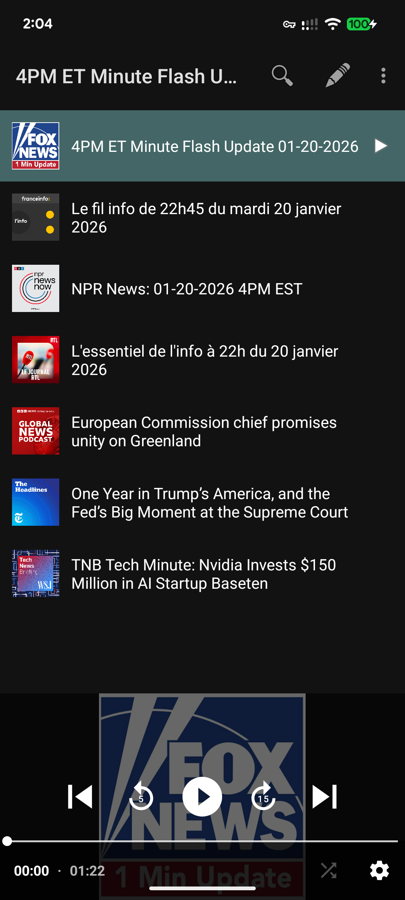
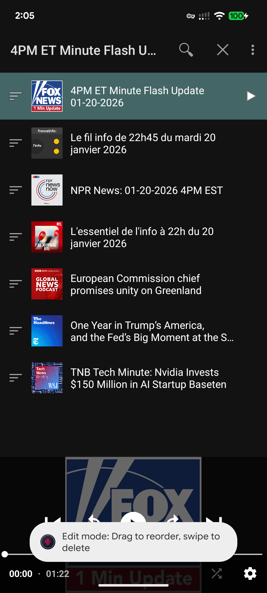
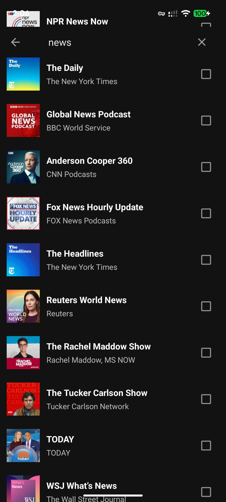

# PlayTheNews

A minimal Android app that automatically plays the latest episode from each of your podcast subscriptions — one after another. Designed for listening to multiple news sources in a single daily session.

## Screenshots

| Playlist | Search | Edit mode |
|----------|--------|-----------|
|  |  |  |

## Features

- **Auto-loads latest episodes** — fetches the most recent episode from each feed on startup
- **Continuous playback** — plays through your list in order, hands-free
- **Resumes where you left off** — per-podcast playback position is saved automatically
- **Background playback** — audio continues when the screen is off or you switch apps
- **OPML import** — load your existing podcast subscriptions from any standard OPML file
- **Podcast search** — discover and add new podcasts via the iTunes directory
- **Reorder & remove** — drag to reorder or swipe to delete in edit mode

## How to use

### Loading your podcasts

1. Tap the **folder icon** in the top bar and select an OPML file from your device.  
   The app will fetch the latest episode from each feed in your list.

   > Don't have an OPML file? Export one from any podcast app (Pocket Casts, AntennaPod, Overcast, etc.).

2. Alternatively, tap the **search icon** to find podcasts by name, check the ones you want, and tap **Add Selected**.

### Playback

- Tap any episode in the list to start playing from that point.
- Use the player controls at the bottom (play/pause, skip forward/back).
- Playback continues in the background and resumes automatically when you reopen the app.
- A progress bar under each episode shows how far you've listened.

### Managing the list

- Tap **Edit** in the top bar to enter edit mode.
- **Drag** the handle on the right to reorder episodes.
- **Swipe left or right** to remove an episode.
- Tap **Done** to save changes.

## Requirements

- Android 8.0 (API 26) or later
